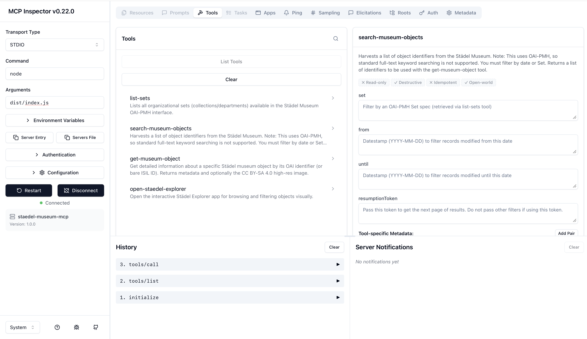
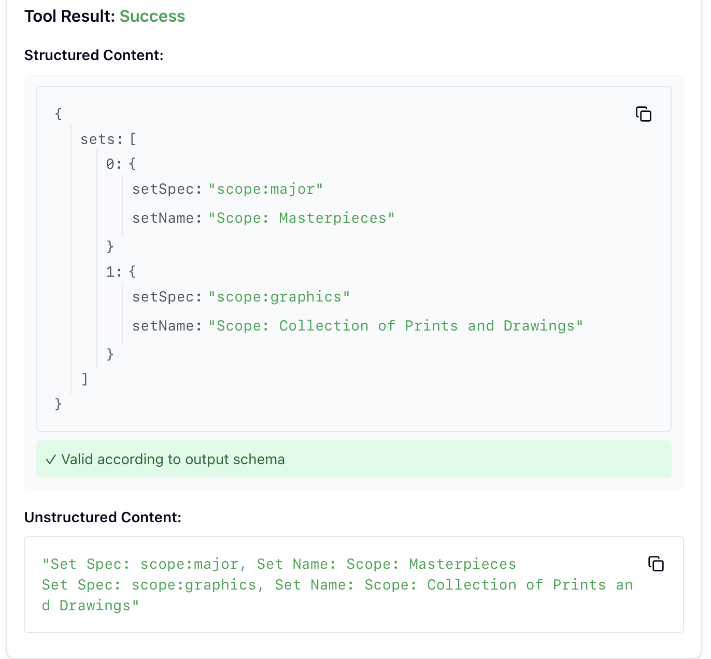

# Städel Museum MCP Server

<p align="center">
  
</p>

A [Model Context Protocol](https://modelcontextprotocol.io) server that gives AI assistants direct
access to the **[Städel Museum](https://www.staedelmuseum.de) Digital Collection**. It talks to the
museum's public [OAI-PMH interface](https://sammlung.staedelmuseum.de/en/oai/guide) (LIDO metadata
format), so an assistant can harvest object records, read rich multilingual metadata, and display
high-resolution artwork images — with an interactive browsing UI ([MCP Apps](https://github.com/modelcontextprotocol/ext-apps))
on top.

> This is a personal portfolio project built to demonstrate working with the Model Context
> Protocol, an OAI-PMH/LIDO harvesting API, and MCP Apps interactive UIs end-to-end — not an
> official Städel Museum product.

## Features

| Tool | Description |
| --- | --- |
| `list-sets` | Lists the OAI-PMH sets (e.g. *Masterpieces*, *Prints and Drawings*) available to filter by. |
| `search-museum-objects` | Harvests the identifiers of live (non-deleted) objects, filtered by `set` and/or a `from`/`until` date range, with pagination via `resumptionToken`. |
| `get-museum-object` | Resolves one object's full LIDO record into clean, normalized JSON — titles, artists, date, medium, dimensions, image, license — plus the image itself. |
| `open-staedel-explorer` | Opens an interactive [MCP App](https://github.com/modelcontextprotocol/ext-apps) UI for browsing and filtering the collection visually, in hosts that support it. |

Because the Städel exposes its collection through OAI-PMH (a harvesting protocol, not a search
engine), there is no full-text keyword search — you filter by **set** and/or **date range**, then
fetch full details per object. The tool descriptions make this explicit so the assistant doesn't
assume Google-style search is available.

<p align="center">
  
</p>

## Architecture

```
src/
├── index.ts      # entry point: stdio, or stateless Streamable HTTP with --http
├── server.ts     # the four tools and the explorer UI resource
├── api.ts        # OAI-PMH client: throttled fetch, retry, XML parsing
├── lido.ts       # flattens a LIDO record into the normalized object (and its Zod schema)
└── explorer.ts   # the self-contained MCP App HTML for the explorer
```

`lido.ts` does the interesting work: LIDO is a verbose, multilingual, deeply nested XML format,
and `flattenLido` turns it into a small, stable JSON shape — resolving `xml:lang` variants
(preferring English, falling back to German), picking the largest image rendition, and reading
each object's actual rights statement instead of assuming one blanket license.

## Licensing & Attribution (important)

* **Metadata** harvested from the OAI-PMH interface is **CC0 1.0** (public domain).
* **Images** are typically **CC BY-SA 4.0 Städel Museum, Frankfurt am Main**, though some objects
  carry a different rights statement (e.g. Public Domain Mark) — `get-museum-object` reports the
  actual license for each object rather than hard-coding one.
* Whenever an assistant displays or describes an image from this server, it should include the
  credit line reported in the `license` field.

## Prerequisites

* [Node.js](https://nodejs.org/) v18 or later
* [pnpm](https://pnpm.io/) (via `corepack`)

## Installation

```bash
git clone https://github.com/topoftheblock/staedel-mcp.git
cd staedel-mcp
corepack enable
pnpm install
pnpm run build
```

## Running

**Stdio** (used by Claude Desktop, Claude Code, and most MCP clients):

```bash
node dist/index.js
```

**Streamable HTTP** (for testing with clients that connect over HTTP):

```bash
node dist/index.js --http
# -> http://localhost:3001/mcp  (localhost only; override the port with the PORT env var)
```

### Add it to Claude Desktop / Claude Code

Add to your MCP client's config (e.g. `claude_desktop_config.json`):

```json
{
  "mcpServers": {
    "staedel-museum": {
      "command": "node",
      "args": ["/absolute/path/to/staedel-mcp/dist/index.js"]
    }
  }
}
```

### Try it with the MCP Inspector

```bash
npx @modelcontextprotocol/inspector node dist/index.js
```

<p align="center">
  
</p>

## Development

```bash
pnpm run watch   # tsc --watch
pnpm run check   # type-check without emitting
```

## Configuration

| Environment variable | Default | Purpose |
| --- | --- | --- |
| `STAEDEL_API_TIMEOUT_MS` | `10000` | Per-request timeout to the Städel API. |
| `PORT` | `3001` | Port for `--http` mode. |

## Reference

* [Städel Digital Collection OAI-PMH guide](https://sammlung.staedelmuseum.de/en/oai/guide)
* [LIDO metadata schema](http://www.lido-schema.org/)
* [Model Context Protocol](https://modelcontextprotocol.io)
* [MCP Apps](https://github.com/modelcontextprotocol/ext-apps)
